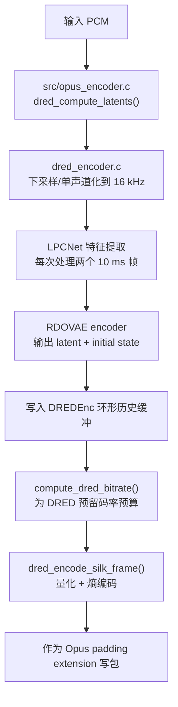
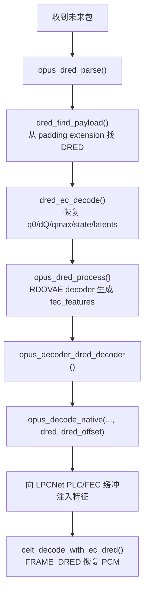
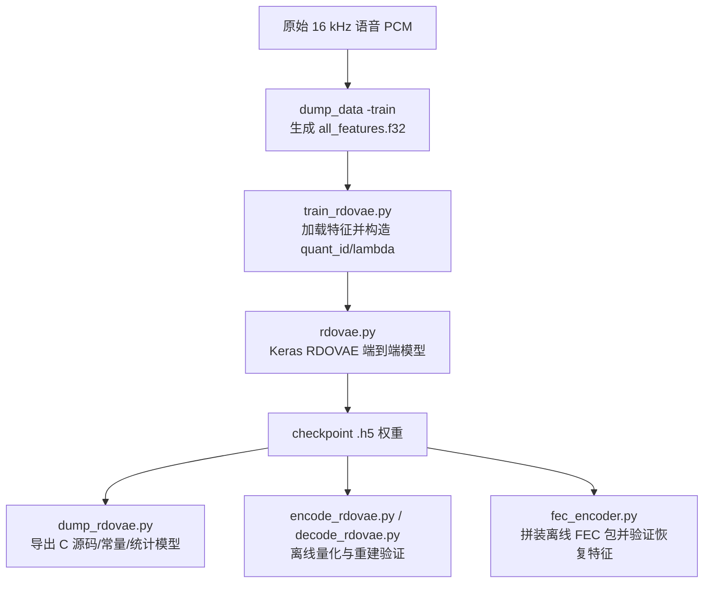

# Opus DRED 源码实现分析

> **Opus 版本**：1.6.1 | **日期**：2026-03-23
>
> **摘要**：本文聚焦 `opus-src/dnn` 下 DRED（Deep REDundancy）相关实现，以及其在 `src/opus_encoder.c`、`src/opus_decoder.c`、`celt/celt_decoder.c` 中的接入方式。同时补充 `training_tf2/` 下的历史 TF2 训练/导出链，说明训练数据如何生成、RDOVAE 如何训练、权重如何导出为 C，以及这条旧链路与当前 1.6.1 运行时权重格式的差异。目标不是介绍如何“使用 DRED”，而是回答三个源码层问题：编码端到底生成了什么、解码端如何把未来包转为过去帧恢复、后续若要优化窗口/码率/模型/接口，应修改哪一层以及风险在哪里。

---

## 目录

1. [分析范围与阅读地图](#1-分析范围与阅读地图)
2. [DRED 的整体设计：它不是第二条 Opus 音频流](#2-dred-的整体设计它不是第二条-opus-音频流)
3. [模块职责总览](#3-模块职责总览)
4. [编码路径：PCM 如何变成 DRED extension](#4-编码路径pcm-如何变成-dred-extension)
5. [解码路径：未来包如何恢复过去帧](#5-解码路径未来包如何恢复过去帧)
6. [关键数据结构与常量](#6-关键数据结构与常量)
7. [模块级详细分析](#7-模块级详细分析)
8. [公共 API / CTL 详解](#8-公共-api--ctl-详解)
9. [包格式与偏移语义](#9-包格式与偏移语义)
10. [与 Opus 主链路的耦合点](#10-与-opus-主链路的耦合点)
11. [训练流程：`training_tf2/` 历史 TF2 链路](#11-训练流程training_tf2-历史-tf2-链路)
12. [对本仓库的直接启示](#12-对本仓库的直接启示)
13. [可优化点与改动风险](#13-可优化点与改动风险)
14. [结论](#14-结论)

---

## 1. 分析范围与阅读地图

本文以 **运行时 C 实现** 与公开 API 为主，并补充 `training_tf2/` 下的历史 TF2 训练/导出流程。需要注意：

- `training_tf2/` 更像是较早期的 RDOVAE 研究链路
- 当前仓库实际运行时使用的 C 代码与权重组织形式，已经更接近后续演进后的导出结果
- 因此 `training_tf2/` 适合帮助理解“模型是怎么训练出来的”，但不应默认认为它与当前 1.6.1 的 `dred_rdovae_*_data.*` 完全同构

主分析对象：

- `opus-src/dnn/dred_config.h`
- `opus-src/dnn/dred_coding.c`
- `opus-src/dnn/dred_encoder.c` / `dred_encoder.h`
- `opus-src/dnn/dred_decoder.c` / `dred_decoder.h`
- `opus-src/dnn/dred_rdovae_enc.c` / `dred_rdovae_enc.h`
- `opus-src/dnn/dred_rdovae_dec.c` / `dred_rdovae_dec.h`
- `opus-src/dnn/dred_rdovae_*_data.*`
- `opus-src/dnn/training_tf2/train_rdovae.py`
- `opus-src/dnn/training_tf2/rdovae.py`
- `opus-src/dnn/training_tf2/dump_rdovae.py`
- `opus-src/dnn/training_tf2/encode_rdovae.py`
- `opus-src/dnn/training_tf2/decode_rdovae.py`
- `opus-src/dnn/training_tf2/fec_encoder.py`
- `opus-src/include/opus.h`
- `opus-src/include/opus_defines.h`
- `opus-src/src/opus_encoder.c`
- `opus-src/src/opus_decoder.c`
- `opus-src/celt/celt_decoder.c`

可把源码分成四层理解：

1. **公共接口层**：`include/opus.h`、`opus_defines.h`
2. **Opus 主链路接入层**：`src/opus_encoder.c`、`src/opus_decoder.c`、`celt/celt_decoder.c`
3. **DRED 业务层**：`dred_encoder.c`、`dred_decoder.c`、`dred_coding.c`
4. **神经网络推理层**：`dred_rdovae_enc.c`、`dred_rdovae_dec.c`、`*_data.c`

---

## 2. DRED 的整体设计：它不是第二条 Opus 音频流

DRED 最容易被误解的点是：它看起来像“包里又塞了一份低码率音频”。但从源码看，DRED 的真实设计是：

- 编码端不生成一段可直接播放的副音频
- 编码端生成的是一组 **低维潜在变量 + 初始状态**
- 解码端先把这些变量还原成 **LPCNet/FEC 特征序列**
- 最后由正常 `OpusDecoder` 的 PLC / neural FEC 路径把这些特征“喂回去”，产出可听 PCM

所以 DRED 不是“第二条 CELT/SILK 码流”，而是：

**一套跨包携带的神经网络冗余描述 + 在解码端借助现有 PLC/神经恢复链完成重建的机制。**

这也是为什么：

- `opus_dred_parse()` 不直接返回 PCM
- `opus_dred_process()` 的输出是 `fec_features`
- `opus_decoder_dred_decode*()` 最终仍调用 `opus_decode_native()`

---

## 3. 模块职责总览


| 模块                     | 主要职责                                         | 关键入口                                                                    |
| ---------------------- | -------------------------------------------- | ----------------------------------------------------------------------- |
| `dred_config.h`        | 定义 DRED 扩展号、窗口大小、帧尺寸、实验版本等静态约束               | 常量宏                                                                     |
| `dred_coding.c`        | 根据 `q0/dQ/qmax` 计算每个 latent chunk 的量化级别      | `compute_quantizer()`                                                   |
| `dred_encoder.c`       | 模型加载、下采样、特征提取、latent/state 缓冲、熵编码            | `dred_compute_latents()`、`dred_encode_silk_frame()`                     |
| `dred_decoder.c`       | 从 extension 负载恢复 `state/latents/dred_offset` | `dred_ec_decode()`                                                      |
| `dred_rdovae_enc.c`    | RDOVAE 编码器前向推理，把双帧特征压成 latent 和初始状态          | `dred_rdovae_encode_dframe()`                                           |
| `dred_rdovae_dec.c`    | RDOVAE 解码器前向推理，把 latent/state 还原为 FEC 特征序列   | `DRED_rdovae_decode_all()`                                              |
| `dred_rdovae_*_data.`* | 编译进库的默认权重与模型结构初始化函数                          | `init_rdovaeenc()`、`init_rdovaedec()`                                   |
| `src/opus_encoder.c`   | 码率预算、DRED 开关、extension 写包、与主编码共享预算           | `compute_dred_bitrate()`，编码主循环                                          |
| `src/opus_decoder.c`   | DRED payload 定位、解析、延迟处理、把特征注入 decoder        | `opus_dred_parse()`、`opus_dred_process()`、`opus_decoder_dred_decode*()` |
| `celt/celt_decoder.c`  | 在真正丢包恢复阶段识别 `FRAME_DRED`，走 neural PLC/FEC 路径 | `celt_decode_with_ec_dred()`                                            |


---

## 4. 编码路径：PCM 如何变成 DRED extension

### 4.1 编码路径流程图




### 4.2 编码端的主控制流

在 `src/opus_encoder.c` 中，DRED 相关逻辑分三步进入主编码流程：

1. **先算预算**
  - `compute_dred_bitrate()` 根据当前总码率、帧长、`packetLossPercentage`、`useInBandFEC` 等信息，先从总预算里切一部分给 DRED
  - `st->bitrate_bps -= dred_bitrate_bps`
  - 这意味着 DRED 不是“包还有剩余才塞”，而是主动参与总码率分配
2. **在真正 SILK/CELT 编码之前计算 DRED 特征**
  - `dred_compute_latents()` 在主编码前执行
  - 注释里写得很明确：`Needs to be before SILK because of DTX`
  - 原因是 DRED 需要看见真实输入帧，即使后续主链路因 DTX 不输出常规音频，也要决定是否保留冗余历史
3. **在包已经基本成型后把 DRED 当作 extension 写入**
  - 当 `first_frame` 且 `dred_duration > 0` 且 `dred_encoder.loaded` 时，才尝试写 extension
  - 通过 `opus_packet_pad_impl(..., &extension, 1)` 把 DRED 塞进 padding 区

### 4.3 为什么叫 `dred_encode_silk_frame()`

函数名叫 `dred_encode_silk_frame()`，但它的角色更接近：

- “把当前历史窗口内已经准备好的 DRED latent/state 编成一个 extension payload”

它并不重新编码 SILK 比特流。命名更多是因为它与 SILK 路径、活动检测和 10ms 语音帧组织方式绑定较深。

### 4.4 特征提取链

`dred_compute_latents()` 是编码端最核心的桥接函数，做了五件事：

1. 根据当前采样率把输入变换到 **16 kHz**
2. 立体声时做 downmix，得到单声道分析输入
3. 把输入按 `DRED_DFRAME_SIZE = 320` 样本组织为 **2 个 10ms 帧**
4. 调用 `lpcnet_compute_single_frame_features_float()` 提取 LPCNet 特征
5. 把两帧特征送入 `dred_rdovae_encode_dframe()`，得到：
  - 一个 `latent`
  - 一个 `initial_state`

这里有两个重要含义：

- DRED 的建模采样率是 **16 kHz**
- DRED 的原始建模对象不是波形，而是 **LPCNet 风格声学特征**

还可以进一步拆成一句更准确的话：

- **LPCNet 负责“从波形提特征”**
- **RDOVAE 负责“把特征压成冗余表示，再从冗余表示还原回特征”**

也就是说，DRED 编码侧并不是 `RDOVAE` 直接处理 PCM，而是：

```text
waveform -> LPCNet feature extractor -> 20 维特征 -> RDOVAE encoder -> latent/state
```

解码侧则是反过来：

```text
latent/state -> RDOVAE decoder -> 20 维 fec_features -> LPCNet/PLC 路径 -> PCM
```

### 4.4.1 这 20 维特征具体是什么

从 `lpcnet.h` 可知：

- `NB_FEATURES = 20`
- `NB_TOTAL_FEATURES = 36`

其中 DRED 真正使用的是前 20 维，后面的 16 维是 LPC 系数等辅助信息，不直接送进 RDOVAE。

这 20 维可以概括为：

- **18 维谱包络特征**
- **1 维 pitch 特征**
- **1 维 pitch correlation / voicing 特征**

源码证据：

- `NB_BANDS = 18`
- `st->features[NB_BANDS] = st->dnn_pitch;`
- `st->features[NB_BANDS + 1] = frame_corr - .5f;`

对应实现位于 LPCNet encoder 特征计算路径中。

### 4.4.2 前 18 维是怎么来的

它们不是随意挑出的 18 个样本统计量，而是一条标准语音参数化链：

1. 先按 Bark/频带能量思路得到分带能量
2. 把能量转到 log 域
3. 对 log-band energy 做 DCT
4. 得到压缩后的 cepstral / bark-cepstral 风格特征

所以这 18 维本质上是在描述：

- 这一帧语音的谱形状
- 共振峰/音色包络
- 哪些频带强、哪些频带弱

这是语音里最核心、最稳定、最适合低维建模的信息。

### 4.4.3 最后两维为什么是 pitch 和相关性

仅靠谱包络不足以表达“声音是如何发声的”，尤其是：

- 这帧有没有明显基频
- 它有多强的周期性
- 是清辅音/噪声，还是元音/有声音

因此 LPCNet 特征又单独补了两类语音感知里非常关键的信息：

- `dnn_pitch`：基频位置
- `frame_corr`：和历史 pitch 周期的相关性，可近似理解为 voiced 程度/周期稳定性

它们的作用是让后续模型区分：

- “频谱相似但发声机制不同”的帧
- “有声周期信号”和“无声噪声信号”

### 4.4.4 这些特征的选取标准是不是针对 MOS

不是直接“为了优化 MOS 分数”设计的，更准确地说，它们是为了满足三个工程目标：

1. **对语音重建最有信息量**
   - 18 维谱包络 + pitch + voicing，已经覆盖语音主观质量里最关键的部分
2. **维度足够低，便于极低码率压缩**
   - DRED 的目标是跨包带一点点冗余，不可能传高维表征
3. **对生成/PLC/FEC 模型足够友好**
   - 这组特征是 LPCNet / neural PLC 已经能稳定消费的控制参数空间

所以它和 MOS 的关系是：

- **间接相关**
- 目标是让恢复后的语音“听起来自然、像人话、保持音色和可懂度”
- 但不是像 PESQ/MOS predictor 那样，直接围绕一个主观分数定义的特征集合

换句话说，20 维特征更像是：

- “适合做语音参数化与生成的低维表示”

而不是：

- “专门为了拟合 MOS 的感知特征”

### 4.4.5 为什么这套特征更适合语音，不太适合音乐

原因也很直接：

- 这 20 维非常擅长描述语音的谱包络、基频和浊音结构
- 但它没有细致表示复杂瞬态、密集谐波、高频细纹理、立体声空间等信息

因此：

- 对语音，它很高效
- 对音乐、环境音、复杂混响，它的表达力明显不如直接频谱或更高维 latent

这也是为什么 DRED 的理论设计本身就是 **偏语音优化** 的。

### 4.5 为什么一次处理两帧

`dred_process_frame()` 每次提取两个 `DRED_FRAME_SIZE=160` 的 10ms 帧，对应一个 20ms 的 “double frame”。  
RDOVAE encoder 的输入也是 `2 * DRED_NUM_FEATURES`。

这决定了后面几个关键事实：

- `latents_buffer_fill` 的增长单位不是 10ms，而是每个 latent 对应一个 20ms 编码单元
- 解码时 `DRED_rdovae_decode_all()` 每个 latent 会恢复 **4 个 10ms 特征帧**
- DRED 的内部时间粒度并不统一：有 2.5ms、10ms、20ms 三套坐标

### 4.6 历史缓冲与活动门控

编码器状态 `DREDEnc` 中维护了：

- `latents_buffer`
- `state_buffer`
- `activity_mem`
- `dred_offset`
- `latent_offset`
- `last_extra_dred_offset`

其中 `activity_mem` 是一个 2.5ms 分辨率的活动历史。`dred_encode_silk_frame()` 会优先跳过不活跃区间：

- `dred_voice_active()` 检查某一历史位置附近是否有语音活动
- 若当前位置静音且之前已经有主音频覆盖，会延后发 DRED
- 若最终只编码到极少 chunk 或全静音，则直接返回 0，不发送空 DRED 包

这说明 DRED 不是简单“过去 N 帧全发”，而是做了一个轻量的 **活动感知裁剪**。

### 4.7 量化与熵编码

真正写包发生在 `dred_encode_silk_frame()`：

- 先写 `q0`
- 再写 `dQ`
- 再写总偏移 `total_offset`
- 可选写 `qmax`
- 然后编码 `state`
- 再按 chunk 编码一组组 `latents`

量化级别来自 `compute_quantizer(q0, dQ, qmax, i)`：

```text
quant = q0 + round(dQ_table[dQ] * i / 16)
clamp 到 qmax
```

含义是：越远的历史 chunk 可以使用更粗的量化，从而节省码率。

### 4.8 DRED extension 写包

写包阶段在 `src/opus_encoder.c` 中完成：

- 计算还剩多少字节可供 DRED 使用
- 扣除 extension signaling 和 padding length 的字节
- 实验版本下先写 `'D'` 和 `DRED_EXPERIMENTAL_VERSION`
- `extension.id = DRED_EXTENSION_ID`
- `extension.frame = 0`
- payload 放入 Opus packet padding extension

这说明 DRED 当前仍是 **Opus padding extension 上的实验扩展**，不是主音频载荷的一部分。

---

## 5. 解码路径：未来包如何恢复过去帧

### 5.1 解码路径流程图




### 5.2 `opus_dred_parse()` 不是解码 PCM

`opus_dred_parse()` 做的事只有三类：

1. 在包的 extension 区里找到 DRED payload
2. 通过 `dred_ec_decode()` 把 payload 解成结构化状态
3. 如有需要，调用 `opus_dred_process()` 把 latent/state 展开成 `fec_features`

返回值也不是 PCM 样本数，而是：

- “从当前包向过去最多可恢复多少样本”

这个返回值在 `opus_demo.c` 和本仓库 `offline_validation` 里都被当成“可恢复窗口大小”来判断是否对丢失帧尝试 DRED 恢复。

### 5.3 payload 定位：DRED 与普通 extension 的分离

`dred_find_payload()` 会：

- 先解析 Opus packet，拿到 padding 段
- 通过 `OpusExtensionIterator` 查找 `DRED_EXTENSION_ID`
- 从 `ext.frame` 推出 `dred_frame_offset`
- 若处于实验版本，则额外校验：
  - `ext.data[0] == 'D'`
  - `ext.data[1] == DRED_EXPERIMENTAL_VERSION`

一个关键细节：`OPUS_SET_IGNORE_EXTENSIONS` **不会影响 DRED**。  
`opus_defines.h` 注释里明确写了：

> ignore all extensions found in the padding area (does not affect DRED, which is decoded separately)

也就是说 DRED 被视为一条单独的恢复路径，而不是通用 extension 处理的一部分。

### 5.4 熵解码产物：不是特征，而是 state + latent

`dred_ec_decode()` 会恢复：

- `dec->dred_offset`
- `dec->state`
- `dec->latents`
- `dec->nb_latents`
- `dec->process_stage = 1`

此时还没有 `fec_features`。  
真正的特征序列是 `opus_dred_process()` 调用 `DRED_rdovae_decode_all()` 后才得到的。

所以 DRED 解码分两段：

1. **码流层解码**：bitstream -> state/latents
2. **模型层解码**：state/latents -> fec_features

`defer_processing=1` 的意义也就在这里：可以把第二段 CPU 开销较大的模型推理延后。

### 5.5 `opus_dred_process()`：把 latent 展成可供恢复的特征序列

`opus_dred_process()` 的前置条件是：

- `src->process_stage == 1` 或 `2`
- `dred_dec` 已加载模型

调用后会：

- 如果 `src != dst`，先拷贝状态
- 若已经 `process_stage == 2`，直接返回
- 否则执行 `DRED_rdovae_decode_all()`
- 输出到 `dst->fec_features`
- 标记 `process_stage = 2`

从这里开始，`OpusDRED` 才变成“可被真正恢复音频”的状态。

### 5.6 `opus_decoder_dred_decode*()`：为什么还要传 `OpusDecoder`

三个 DRED 音频恢复接口：

- `opus_decoder_dred_decode()`
- `opus_decoder_dred_decode24()`
- `opus_decoder_dred_decode_float()`

都需要一个正常 `OpusDecoder *st`。原因是：

- DRED 并不自己合成 PCM
- 它要复用 `OpusDecoder` 内部的 PLC / LPCNet / CELT 状态机
- 最终入口仍然是 `opus_decode_native(..., dred, dred_offset)`

也就是说，DRED 恢复的真实执行者是 **正常解码器 + 一组额外注入的 FEC 特征**。

### 5.7 特征如何被喂给 decoder

在 `opus_decode_native()` 中，如果发现：

- `dred != NULL`
- `dred->process_stage == 2`

就会：

- 先 `lpcnet_plc_fec_clear(&st->lpcnet)`
- 按 `frame_size` 和 `dred_offset` 计算需要喂几帧 feature
- 调用 `lpcnet_plc_fec_add()` 把 `dred->fec_features` 中对应偏移的特征逐帧加入 decoder 的 neural PLC/FEC 队列

这里的偏移公式是：

```text
feature_offset = init_frames - i - 2
               + floor((dred_offset + dred->dred_offset*F10/4) / F10)
```

其本质是在做：

- 样本偏移 -> 10ms feature 索引 的映射
- 同时补偿 PLC 内部的启动帧与 5ms overlap

### 5.8 在 CELT decoder 中真正落到 `FRAME_DRED`

在 `celt/celt_decoder.c` 中：

- 如果 `lpcnet->fec_fill_pos > lpcnet->fec_read_pos`
- 则当前丢包帧类型被设置为 `FRAME_DRED`

之后会走和 neural PLC 非常接近的路径，但语义不同：

- `FRAME_PLC_NEURAL`：特征来自 decoder 自己做的 concealment
- `FRAME_DRED`：特征来自未来包携带的 DRED 冗余

最后若是 `FRAME_DRED`，代码会：

- `st->plc_duration = 0`
- `st->skip_plc = 0`

这等价于告诉解码器：“这不是一次普通 PLC 外推，而是一次有真实冗余支撑的恢复。”

---

## 6. 关键数据结构与常量

### 6.1 关键常量与物理意义


| 常量                             | 值     | 含义                         |
| ------------------------------ | ----- | -------------------------- |
| `DRED_EXTENSION_ID`            | `126` | 当前实验扩展号                    |
| `DRED_EXPERIMENTAL_VERSION`    | `12`  | 当前实验版本号                    |
| `DRED_MIN_BYTES`               | `8`   | 小于该字节数时不值得发 DRED           |
| `DRED_FRAME_SIZE`              | `160` | 10ms@16kHz                 |
| `DRED_DFRAME_SIZE`             | `320` | 20ms@16kHz，RDOVAE 编码的基础输入块 |
| `DRED_MAX_LATENTS`             | `26`  | 最多保留 26 个 latent 单元        |
| `DRED_NUM_REDUNDANCY_FRAMES`   | `52`  | 冗余 10ms 帧上限，约 1.04s        |
| `DRED_MAX_FRAMES`              | `104` | 内部历史缓冲上限                   |
| `DRED_NUM_FEATURES`            | `20`  | 每个 10ms 特征帧 20 维           |
| `DRED_LATENT_DIM`              | `25`  | 每个 latent 的核心维度            |
| `DRED_STATE_DIM`               | `50`  | RDOVAE 初始状态维度              |
| `DRED_NUM_QUANTIZATION_LEVELS` | `16`  | 量化等级数量                     |


### 6.2 `DREDEnc` 关键字段


| 字段                       | 作用                  | 备注                            |
| ------------------------ | ------------------- | ----------------------------- |
| `input_buffer`           | 暂存 16k 输入样本         | 用于凑满 20ms 双帧                  |
| `input_buffer_fill`      | 当前已填样本数             | 初始带 `DRED_SILK_ENCODER_DELAY` |
| `dred_offset`            | 当前 DRED 对真实音频的时间偏移  | 会随 lookahead 和处理推进变化          |
| `latent_offset`          | 当前编码起点在历史中的偏移       | 静音跳过时会推进                      |
| `last_extra_dred_offset` | 延迟发送静音后第一段 DRED 的补偿 | 处理“刚出静音”场景                    |
| `latents_buffer`         | 历史 latent 环形/滑动缓冲   | 最近历史的低维表示                     |
| `latents_buffer_fill`    | 当前可用 latent 数量      | 决定最多能编码多少 chunk               |
| `state_buffer`           | 每个 latent 对应的初始状态   | 和 latent 同步滑动                 |
| `resample_mem`           | 下采样滤波器状态            | 保证跨帧连续性                       |


### 6.3 `OpusDRED` 关键字段


| 字段              | 作用                         | 何时有效                 |
| --------------- | -------------------------- | -------------------- |
| `fec_features`  | RDOVAE 解码后的特征序列            | `process_stage == 2` |
| `state`         | 从 bitstream 解出的初始状态        | `dred_ec_decode()` 后 |
| `latents`       | 从 bitstream 解出的 latent 列表  | `dred_ec_decode()` 后 |
| `nb_latents`    | 实际解出多少 latent              | `dred_ec_decode()` 后 |
| `process_stage` | `1` 表示只完成熵解码，`2` 表示已完成模型解码 | 全流程状态位               |
| `dred_offset`   | DRED 序列相对真实音频的起始偏移         | 偏移换算核心字段             |


---

## 7. 模块级详细分析

### 7.1 `dred_config.h`

这个头文件的作用不是“参数配置文件”，而是把整个 DRED 子系统的几个不可随意改的协议/实现常量集中在一起：

- `DRED_EXTENSION_ID`：包扩展类型号
- `DRED_EXPERIMENTAL_VERSION`：实验版本标识
- `DRED_FRAME_SIZE` / `DRED_DFRAME_SIZE`：DRED 内部时间粒度
- `DRED_MAX_LATENTS` / `DRED_NUM_REDUNDANCY_FRAMES`：最大恢复窗口

要注意：

- 这些值不只是本地实现常量，部分已经进入 **包格式语义**
- 改它们通常不是简单的“模型升级”，而是会影响兼容性、偏移计算、缓冲大小甚至 on-wire 解释方式

### 7.2 `dred_coding.c`

这个文件只有一个核心函数 `compute_quantizer()`，但它非常关键，因为它定义了 **离当前越远的历史冗余，用多粗的量化编码**。

可把它理解成一个“随时间衰减的量化策略”：

- 最近的历史，量化更细
- 更远的历史，量化更粗
- 最终不超过 `qmax`

这层不负责实际熵编码，只负责提供每个 chunk 的目标量化等级。

### 7.3 `dred_encoder.c`

这是 DRED 编码业务层核心。

#### 7.3.1 模型加载

- `dred_encoder_load_model()` 从 blob 解析权重
- 同时初始化：
  - `RDOVAEEnc model`
  - `LPCNetEncState`

说明编码端 DRED 依赖两类模型/组件：

- LPCNet 特征前端
- RDOVAE 压缩模型

#### 7.3.2 初始化和 reset

- `dred_encoder_init()` 记录 `Fs`、`channels`
- 非 `USE_WEIGHTS_FILE` 时，直接使用编译进库的默认权重
- `dred_encoder_reset()` 会清空运行时状态，但保留模型本身

#### 7.3.3 16k 下采样

`dred_convert_to_16k()` 处理多种采样率：

- 8k
- 12k
- 16k
- 24k
- 48k
- 可选 96k

并在双声道场景做 downmix。  
这说明 DRED 的神经网络本体不随主 Opus 采样率变化，而是统一工作在 16k 分析域。

#### 7.3.4 特征提取与 RDOVAE 编码

`dred_process_frame()`：

- 对两个 10ms 输入块提取 LPCNet 特征
- 丢掉 LPC 系数，只保留前 `DRED_NUM_FEATURES`
- 调用 `dred_rdovae_encode_dframe()`
- 把输出推进历史缓冲

这里说明 DRED 的“压缩对象”是经过设计裁剪的声学特征，而不是全量 LPCNet 特征。

如果要从职责上更明确地区分：

- `LPCNet` 在这里是 **前端分析器**
  - 它把原始波形变成可建模的 20 维语音特征
- `RDOVAE` 在这里是 **冗余压缩器**
  - 它不负责从 PCM 抽特征
  - 它只负责把这 20 维特征进一步压成 `latent + state`

因此后续如果要优化“特征定义”，优先看 LPCNet 特征侧；  
如果要优化“同样特征下怎么压得更省、恢复得更好”，优先看 RDOVAE。

#### 7.3.5 活动驱动的 chunk 选择

`dred_encode_silk_frame()` 会根据 `activity_mem` 决定从哪个历史位置开始编码，并尽量避免：

- 全静音包
- 刚出静音时冗余重复覆盖主音频

这块逻辑对真实语音链路很重要，因为它直接决定：

- DRED 的平均开销
- 静音区是否浪费冗余预算
- 第一段有声恢复是否对齐

### 7.4 `dred_decoder.c`

它只做“码流层”解码，不做神经网络推理。

#### 7.4.1 `dred_decode_latents()`

逐维执行：

- `ec_laplace_decode_p0()`
- 依据 `scale` 恢复浮点近似值

这说明 latent/state 的编码方式不是简单 uniform quantization，而是结合统计参数做 Laplace 熵编码。

#### 7.4.2 `dred_ec_decode()`

按顺序解析：

1. `q0`
2. `dQ`
3. `extra_offset`
4. `dred_offset`
5. `qmax`
6. `state`
7. 一组 latent chunk

并且有两个重要特征：

- 只解到 `min_feature_frames` 需要的范围，不一定把包里所有冗余都展开
- latent 在逻辑上是“从新到旧读取，再按旧到新存储”，方便后续按时间顺序恢复

### 7.5 `dred_rdovae_enc.c`

这个文件实现的是 RDOVAE encoder 前向推理。

其网络结构从代码上看是：

- 多层 dense
- 多层 GRU
- 多层 1D conv / dilated conv
- 最后投影到：
  - `latent`
  - `initial_state`

核心认识：

- 它输出的不是压缩比特流
- 输出的是供后续量化/熵编码使用的 **连续 latent/state**
- 量化与熵编码是在 `dred_encoder.c` 完成，不在 RDOVAE encoder 内部完成

这也解释了一个常见误解：  
`RDOVAE` 不是“特征提取器”，它看到的输入已经是提取好的双帧声学特征。它做的是：

- 降维
- 预测性状态建模
- 为后续量化/熵编码准备一个更紧凑、更平滑的表示空间

### 7.6 `dred_rdovae_dec.c`

这个文件实现 RDOVAE decoder 前向推理。

#### 7.6.1 `dred_rdovae_dec_init_states()`

根据 `initial_state` 生成多层 GRU 初始状态。  
这意味着 bitstream 中那个 50 维 `state` 不是 decoder 内部 GRU state 的直接拷贝，而是经过一个隐藏初始化网络映射后的紧凑表示。

#### 7.6.2 `dred_rdovae_decode_qframe()`

输入一个 latent，输出一个 quadruple feature frame。  
源码注释已经明确：

- 输出是“四个串联的特征帧，且按 reverse order 组织”

#### 7.6.3 `DRED_rdovae_decode_all()`

它负责：

- 初始化 decoder state
- 遍历所有 latent
- 每个 latent 解出 4 个 10ms feature frame
- 把结果铺到 `features` 缓冲

所以 `nb_latents * 4` 近似对应可恢复的 10ms 特征帧总数。

把它和 LPCNet 的职责放在一起看，解码侧分工就是：

- `RDOVAE decoder`：`latent/state -> fec_features`
- `LPCNet PLC/FEC path`：`fec_features -> 可供 concealment 使用的语音控制参数`
- `CELT/decoder state machine`：真正把这些控制参数落成恢复音频

### 7.7 `dred_rdovae_*_data.`*

这些文件本质是：

- 已导出的静态模型权重
- 对应的 `init_rdovaeenc()` / `init_rdovaedec()` 初始化器

它们和 `OPUS_SET_DNN_BLOB` 的关系是：

- 若不是 `USE_WEIGHTS_FILE`，可直接使用编译进库的默认权重
- 若启用了外部权重文件模式，则运行时必须通过 `OPUS_SET_DNN_BLOB` 注入 blob

从 `write_lpcnet_weights.c` 可以看出，一个统一 blob 里可以同时装入多类模型权重，DRED 只是其中一部分。

---

## 8. 公共 API / CTL 详解

### 8.1 API / CTL 对照表


| 接口                                 | 所属对象                             | 作用                                | 关键前置条件                      |
| ---------------------------------- | -------------------------------- | --------------------------------- | --------------------------- |
| `OPUS_SET_DRED_DURATION(x)`        | `OpusEncoder`                    | 配置最多多少个 10ms 冗余帧                  | `0 <= x <= DRED_MAX_FRAMES` |
| `OPUS_GET_DRED_DURATION(x)`        | `OpusEncoder`                    | 读取当前 DRED 窗口配置                    | encoder 已初始化                |
| `OPUS_SET_DNN_BLOB(data, len)`     | encoder / decoder / DRED decoder | 注入外部 DNN 权重 blob                  | `data != NULL` 且 `len >= 0` |
| `opus_dred_decoder_create()`       | DRED decoder                     | 分配并初始化 DRED decoder               | 库编译启用 DRED                  |
| `opus_dred_decoder_init()`         | DRED decoder                     | 初始化已分配对象                          | 已有足够内存                      |
| `opus_dred_decoder_destroy()`      | DRED decoder                     | 释放对象                              | 来自 `create()`               |
| `opus_dred_decoder_ctl()`          | DRED decoder                     | 当前主要用于载入 DNN blob                 | 模型可用                        |
| `opus_dred_alloc()`                | `OpusDRED`                       | 分配 DRED packet/state 容器           | 库编译启用 DRED                  |
| `opus_dred_free()`                 | `OpusDRED`                       | 释放 DRED state                     | 来自 `alloc()`                |
| `opus_dred_parse()`                | DRED decoder + DRED state        | 从包中提取并解析 DRED                     | `dred_dec` 已加载模型            |
| `opus_dred_process()`              | DRED decoder + DRED state        | 把 latent/state 展开成 `fec_features` | `process_stage == 1/2`      |
| `opus_decoder_dred_decode()`       | normal decoder + DRED state      | 16-bit PCM 恢复                     | `dred->process_stage == 2`  |
| `opus_decoder_dred_decode24()`     | normal decoder + DRED state      | 24-bit PCM 恢复                     | 同上                          |
| `opus_decoder_dred_decode_float()` | normal decoder + DRED state      | float PCM 恢复                      | 同上                          |


### 8.2 `OPUS_SET_DRED_DURATION`

作用边界：

- 打开 DRED 开关
- 设置 **最大** 冗余时间窗
- 同时置位 `st->silk_mode.useDRED`

但它 **不保证一定有 DRED 数据输出**。是否真的写包，还依赖：

- 是否加载 DNN 模型
- `packetLossPercentage`
- 当前码率预算
- 是否有足够字节空间
- 活动门控后是否仍有值得发送的 chunk

### 8.3 `OPUS_SET_DNN_BLOB`

这个 CTL 在不同对象上的作用并不相同：

- 对 `OpusEncoder`：加载 DRED encoder 相关模型
- 对 `OpusDecoder`：加载 LPCNet PLC / OSCE 等 normal decoder 侧模型
- 对 `OpusDREDDecoder`：加载 RDOVAE decoder 模型

因此如果要完整启用 DRED 链路，通常需要：

- encoder 侧设置 blob
- normal decoder 侧设置 blob
- DRED decoder 侧设置 blob

本仓库 `offline_validation` 和 `webrtc_demo/internal/opusx/opus.go` 也是这样做的。

### 8.4 `opus_dred_parse`

输入：

- `dred_dec`
- `dred`
- `packet data/len`
- `max_dred_samples`
- `sampling_rate`
- `dred_end`
- `defer_processing`

输出语义：

- 返回“可恢复的 DRED 样本窗口长度”
- `dred_end` 表示从 DRED 时间戳到最后一个 DRED 样本之间，末尾有多少静音/未编码区域

常见误用：

- 把返回值当成“当前帧可直接播放样本数”
- 不给 `dred_dec` 加载模型就调用
- `max_dred_samples` 传得过大，导致无谓解析更多历史

### 8.5 `opus_dred_process`

作用：

- 把 `process_stage == 1` 的中间状态推进到 `process_stage == 2`

适用场景：

- 想把熵解码和模型推理解耦
- 想在主线程外延迟做较重的处理

若 `opus_dred_parse(..., defer_processing=0)`，通常不需要手动再调用一次。

### 8.6 `opus_decoder_dred_decode`*

作用：

- 恢复指定 `dred_offset` 处的一段历史音频

关键点：

- `dred_offset` 单位是样本，不是帧
- `frame_size` 必须是 2.5ms 的整数倍
- 真正执行路径仍进入 `opus_decode_native()`

常见误用：

- 用错误的偏移单位
- 还没 `process_stage == 2` 就尝试 decode
- 误以为它不依赖正常 `OpusDecoder` 内部状态

---

## 9. 包格式与偏移语义

### 9.1 DRED 负载的逻辑组成

从 `dred_encode_silk_frame()` / `dred_ec_decode()` 看，DRED payload 逻辑上包含：

1. `q0`
2. `dQ`
3. `total_offset`
4. 可选 `qmax`
5. 量化后的 `state`
6. 一组量化后的 `latent`

实验版本下，payload 前还有：

- `'D'`
- `DRED_EXPERIMENTAL_VERSION`

### 9.2 三种 offset

源码里有三个容易混淆的偏移量：


| 名称                                                                | 所在层                | 含义                                       |
| ----------------------------------------------------------------- | ------------------ | ---------------------------------------- |
| `dred_frame_offset`                                               | packet extension 层 | DRED extension 在多帧包中的 frame 位置，单位约 2.5ms |
| `dec->dred_offset` / `dred->dred_offset`                          | DRED 解析结果          | DRED 时间轴相对真实包起点的内部偏移                     |
| `opus_decoder_dred_decode(..., dred_offset, ...)` 的 `dred_offset` | 外部 API             | 调用者希望恢复的历史样本位置                           |


最终恢复时，三者会在 `opus_decode_native()` 中汇总为 feature 索引。

### 9.3 为什么同时有样本、10ms、2.5ms 单位

因为 DRED 需要同时兼顾三个系统：

- **Opus packet / multiframe signaling**：天然偏 2.5ms 粒度
- **LPCNet / FEC feature**：天然偏 10ms 粒度
- **外部解码 API**：对用户最自然的是样本单位

所以内部必须不断做：

- 样本数 <-> 10ms frame
- 10ms frame <-> 2.5ms slot

这也是 DRED 偏移逻辑最容易出错的地方。

### 9.4 `dred_end` 的意义

`dred_end` 不是“解析到了结尾”，而是：

- DRED 时间戳到最后一个有效 DRED 样本之间，尾部有多少未编码样本

它主要用于帮助调用者理解：

- 当前 future packet 所携带的 DRED 冗余，真实覆盖到哪一段历史
- 是否有尾部空洞

---

## 10. 与 Opus 主链路的耦合点

### 10.1 编码侧：码率预算耦合

`compute_dred_bitrate()` 是编码侧最关键耦合点。

它与以下因素直接绑定：

- `packetLossPercentage`
- `useInBandFEC`
- 总码率
- 帧长
- `use_vbr`
- `dred_duration`

其结果包括：

- `dred_bitrate_bps`
- `st->dred_q0`
- `st->dred_dQ`
- `st->dred_qmax`
- `st->dred_target_chunks`

核心机制：

- 先估算 DRED 占比 `dred_frac`
- 再估算在该预算下最多可编码多少 chunk
- 若连 2 个 chunk 都不够，就直接放弃 DRED

这解释了为什么：

- DRED 必须依赖 `OPUS_SET_PACKET_LOSS_PERC`
- 低码率 / CBR / 复杂内容下 DRED 容易被“挤死”

### 10.2 解码侧：注入 LPCNet PLC/FEC

DRED 恢复并非直接在 `dred_decoder.c` 里完成，而是靠 `opus_decode_native()` 向 `st->lpcnet` 注入 feature。

因此 DRED 与 decoder 的耦合点是：

- LPCNet PLC/FEC 缓冲
- decoder 当前历史状态
- CELT decoder 当前 PLC 状态机

也就是说如果未来要替换 PLC/neural concealment 路径，DRED 很可能也要一起改。

### 10.3 CELT decoder：`FRAME_DRED`

在 `celt/celt_decoder.c` 中，`FRAME_DRED` 是一个明确的帧类型。

含义是：

- 当前不是盲目外推
- 当前有来自 future packet 的 DRED feature 支撑

这会影响：

- 是否走 neural path
- `plc_duration` 是否清零
- `skip_plc` 是否复位

所以 DRED 不只是 decoder 入口新增了一个 API，而是改变了 PLC 状态机中的某些状态转移。

---

## 11. 训练流程：`training_tf2/` 历史 TF2 链路

### 11.1 先说结论：`training_tf2/` 是什么

`training_tf2/` 目录不是运行时必须依赖的代码，而是一套较早期的 **TensorFlow 2 / Keras RDOVAE 研究与导出工具链**。它覆盖了：

- 训练数据准备后的特征读入
- RDOVAE encoder / decoder 的 Keras 定义
- 率失真联合训练
- 量化统计模型学习
- 将训练出的权重导出为 C
- 离线编码/解码与 FEC 包拼装验证

这条链路的意义主要有两个：

1. 帮助理解 C 运行时中的 `latent/state/statistical model` 是如何来的
2. 为后续重新训练或做结构实验提供一个旧版参考

但要特别注意：  
**它不是当前 1.6.1 运行时权重格式的最新唯一来源。**

从代码上能看出几个明显差异：

- `training_tf2/rdovae.py` 里 `nb_state_dim = 24`
- `dump_rdovae.py` 导出的 `DRED_STATE_DIM` 也是 `24`
- 当前运行时 `opus-src/dnn/dred_rdovae_constants.h` 中 `DRED_STATE_DIM = 50`
- `training_tf2/dump_rdovae.py` 导出的统计数组名是 `dred_quant_scales_q8` 等
- 当前运行时使用的是拆分后的 `dred_latent_*` 与 `dred_state_*` 两套统计数组

因此更准确的说法是：

- `training_tf2/` 解释了 **DRED 训练思想与旧版工程落地方式**
- 当前 `opus-src/dnn/dred_rdovae_*_data.*` 更接近后续演进后的导出结果

### 11.2 训练链总览



### 11.3 数据准备：训练输入不是波形，而是 `dump_data` 产出的特征

`torch/rdovae/README.md` 和 `training_tf2/fec_encoder.py` 都说明了训练前的数据准备逻辑：

1. 收集并拼接语音语料
2. 统一到 16 kHz
3. 用 `dump_data -train all_speech.pcm all_features.f32 /dev/null` 生成特征

这里最关键的一点是：

- RDOVAE 训练时直接吃的不是 PCM
- 而是 `dump_data` 产出的 `float32` 特征文件

在 `train_rdovae.py` 中：

- 每帧总特征数为 `nb_used_features + lpc_order`
- 其中 `lpc_order = 16`
- 真正用于 RDOVAE 训练的是前 `nb_used_features = 20`

也就是说训练目标和运行时 DRED 一致，都是围绕 **20 维声学特征** 展开，而不是端到端波形重建。

### 11.4 `train_rdovae.py` 做了什么

`train_rdovae.py` 是训练主入口，流程相对直接：

1. 使用 `tf.distribute.MultiWorkerMirroredStrategy()`
2. 调 `rdovae.new_rdovae_model(...)` 建立端到端模型
3. 从 `.f32` 文件里按 `(nb_sequences, sequence_size, nb_features)` 方式 mmap 读入训练样本
4. 截断到前 20 维有效特征
5. 为每个样本随机生成量化等级 `quant_id`
6. 由 `quant_id` 映射出 `lambda_val`
7. 用四个输出头和联合 loss 做训练
8. 每轮输出 `.h5` checkpoint

脚本里最关键的训练设置是：

- `new_rdovae_model(nb_used_features=20, nb_bits=80, ..., nb_quant=16)`
- `loss=[feat_dist_loss, feat_dist_loss, sq1_rate_loss, sq2_rate_loss]`
- `loss_weights=[.5, .5, 1., .1]`

这说明旧版 TF2 RDOVAE 的核心思想是：

- 用一个统一模型同时学会
  - 重建特征
  - 近似量化下的重建
  - 软率估计
  - 硬率估计

### 11.5 `rdovae.py`：模型结构怎么搭

`rdovae.py` 是 TF2 链路真正的核心。

它定义了三层东西：

1. **量化与 loss 工具**
2. **encoder / decoder 网络结构**
3. **端到端训练图**

#### 11.5.1 encoder 结构

`new_rdovae_encoder()` 的输入是：

- `(None, nb_used_features)` 的特征序列

然后先执行：

- `Reshape((-1, 2*nb_used_features))`

这意味着旧版 TF2 训练和当前 C 运行时一样，也是按 **双 10ms 帧拼成一个 20ms 单元** 做编码。

其后堆叠的是：

- 多层 Dense
- 三层 GRU
- 最后一层 `Conv1D(bits_dense)` 产出 `nb_bits=80` 个编码符号

同时 encoder 还会通过 `gdense1/gdense2` 输出一个全局 decoder 初始状态。

#### 11.5.2 decoder 结构

`new_rdovae_decoder()` 接收：

- `bits_input`
- `gru_state_input`

结构上是：

- 先 time-reverse
- 多层 Dense + GRU 逐层展开
- 最终 `dec_final` 输出 `bunch * nb_used_features`
- 再 reshape 回特征序列

可把它理解成：

- encoder：20ms -> 80 维符号 + state
- decoder：符号 + state -> 一串恢复特征

#### 11.5.3 量化统计模型

`new_rdovae_model()` 中还有一组关键对象：

- `qembedding = Embedding(nb_quant, 6*nb_bits, ...)`

这组 embedding 会拆成：

- `quant_scale`
- `dead_zone`
- `soft_distr_embed`
- `hard_distr_embed`

也就是说 TF2 链路里“统计模型”不是单独后处理拟合，而是和主模型一起学习。  
后面 C 运行时里看到的：

- quant scale
- dead zone
- rate parameter `r`
- zero probability `p0`

本质上都来自这层 embedding 的导出。

### 11.6 训练目标：不是纯重建，而是率失真联合优化

`rdovae.py` 里几个关键 loss 决定了这条链路的训练目标。

#### 11.6.1 `feat_dist_loss`

它衡量特征失真，且对不同维度赋予不同权重：

- 前 18 维 cepstral 特征：平方误差
- 第 19 维 pitch：更高权重，且按 voiced 程度做缩放
- 第 20 维相关性/voicing：单独处理

这说明 DRED 训练时并不是简单把 20 个特征等权看待，而是把：

- 谱包络
- 音高
- 浊音相关指标

区别对待。

这也进一步说明这 20 维特征的设计目标：

- 不是直接面向 MOS 打分
- 而是面向“哪些语音参数一旦错了，主观听感会很快变差”

例如：

- pitch 错了，语音会跑调、机械感强
- voicing/correlation 错了，有声和无声会混淆
- 谱包络错了，音色和清晰度会明显失真

因此它本质上仍然是 **语音声学参数化**，只是最终会间接影响听感和 MOS。

#### 11.6.2 `sq1_rate_loss` / `sq2_rate_loss`

这两个 loss 近似量化后码率：

- `sq1_rate_loss` 用软量化符号估计 rate
- `sq2_rate_loss` 用硬量化符号估计 rate

从实现上看，它们使用了 learned distribution parameter：

- `r`
- `p0`

并依据离散 Laplace 风格分布来估计每个符号的编码开销。

这与当前 C 运行时 `dred_encode_latents()` / `dred_decode_latents()` 用 Laplace 熵编码是同一思路：  
**训练时就把“未来要怎么熵编码”纳入优化目标。**

### 11.7 训练图里的量化近似

`new_rdovae_model()` 还显式实现了训练时的量化近似链：

- `apply_dead_zone()`
- `UniformNoise()` 做噪声近似量化
- `hard_quantize()`
- `pvq_quantize()` 用于全局 state 的约束

这说明 TF2 训练不是“先训 float 模型，再单独做后量化”，而是：

- 训练阶段就把 dead-zone、soft/hard quantization、rate model 合在一起

这也是它叫 **RDO-VAE** 的核心：  
rate 和 distortion 在训练时共同被优化。

### 11.8 checkpoint 之后怎么验证

`training_tf2/` 提供了几条辅助脚本，帮助在不进 C 运行时的情况下验证模型。

#### 11.8.1 `encode_rdovae.py`

用途：

- 对特征文件跑 encoder
- 导出：
  - `-state.f32`
  - `-syms.f32`
  - `-input.f32`
  - `-quant_out.f32`

可用于检查：

- encoder 输出符号分布
- 量化前后重建差异
- decoder 输入输出是否稳定

#### 11.8.2 `decode_rdovae.py`

用途：

- 读取 `encode_rdovae.py` 导出的符号和 state
- 重新做量化近似
- 跑 decoder 恢复特征

这条链更像一个“离线 sanity check”，验证：

- 保存/载入后的符号是否仍可解码
- 量化逻辑和 decoder 是否一致

#### 11.8.3 `fec_encoder.py`

用途：

- 读取音频
- 调 `dump_data -test` 提取特征
- 跑 encoder / quantization / decoder
- 按历史窗口组织成离线 `.fec` 包或 `_fec.f32` 特征输出

它比 `encode_rdovae.py` 更接近真实 DRED 使用场景，因为它处理了：

- `silk_delay`
- `zero_history`
- 冗余窗口长度
- 连续丢包时如何从未来 packet 拼回过去特征

因此如果想理解“训练模型在真实 FEC 场景怎么用”，`fec_encoder.py` 是 `training_tf2/` 里最接近运行时语义的脚本。

### 11.9 权重如何导出到 C

`dump_rdovae.py` 是 TF2 链路连接 C 运行时的关键桥梁。

它会：

1. 载入 `.h5` 权重
2. 从 Keras 层中提取 Dense / GRU / Conv1D 权重
3. 生成：
   - `dred_rdovae_enc_data.c/.h`
   - `dred_rdovae_dec_data.c/.h`
   - `dred_rdovae_stats_data.c/.h`
   - `dred_rdovae_constants.h`

其中：

- encoder / decoder 权重通过 `dump_dense_layer()`、`dump_gru_layer()`、`dump_conv1d_layer()` 导出
- `qembedding` 被转成 quant scale / dead zone / `r` / `p0` 统计参数

这就是为什么当前 C 运行时一方面有网络层权重，另一方面还有独立统计数组：  
旧版 TF2 训练时，这两部分本来就来自同一套 embedding + network。

### 11.10 `training_tf2/` 与当前 1.6.1 运行时的差异

这一节很重要，因为后续如果想“重新训练一个模型替换当前 runtime”，不能直接假设 `training_tf2/` 产物可无缝替换。

从源码可见的主要差异包括：

| 项目 | `training_tf2/` | 当前 1.6.1 运行时 |
|------|-----------------|------------------|
| state 维度 | `24` | `50` |
| latent / bit 维度 | `80` 符号空间 | 当前 runtime `DRED_LATENT_DIM = 25` |
| 统计数组组织 | 单套 `dred_quant_scales_q8` 风格 | 分为 `latent` 和 `state` 两套统计数组 |
| 导出脚本 | `dump_rdovae.py` | 当前更接近 `torch/rdovae/export_rdovae_weights.py` |
| 工程定位 | 旧版 TF2 研究链 | 当前 runtime 直接依赖的导出格式 |

因此更合理的定位是：

- 想理解“DRED 为什么是 latent + state + rate model”：
  看 `training_tf2/`
- 想重训并直接替换当前 1.6.1 runtime 权重：
  更应优先参考 `torch/rdovae/` 的训练与导出链

### 11.11 对后续优化的实际价值

即便 `training_tf2/` 不是当前最新产物，它仍然很有价值，因为它把几个关键设计动机暴露得很清楚：

- 为什么 DRED 不是直接压 PCM，而是压 20 维特征
- 为什么量化统计模型要和主模型一起学
- 为什么运行时会有 `state` 和 `latent` 两类数据
- 为什么熵编码参数 `r/p0` 会作为单独统计数组存在

如果后续要改：

- 特征定义
- quantization policy
- rate model
- latent/state 维度

最容易先在 `training_tf2/rdovae.py` 这种高层原型里验证思路，再决定是否迁移到当前导出链。

---

## 12. 对本仓库的直接启示

### 12.1 `offline_validation`

本仓库离线仿真路径基本遵循官方 `opus_demo.c` 思路：

- encoder 侧调用 `OPUS_SET_DRED_DURATION`
- encoder / decoder / DRED decoder 三处都注入 `weights_blob.bin`
- 丢包后在未来包到达时先 `opus_dred_parse()`
- 再对丢失帧逐个调用 `opus_decoder_dred_decode()`

这条路径比较接近理想参考实现，适合做：

- 参数扫描
- 偏移逻辑验证
- DRED 可恢复窗口分析

### 12.2 `opus_sender` / `opus_receiver`

实时链路比离线仿真多了一个不确定性：

- 你不一定总能“刚好拿到那个 future packet”

因此 DRED 在实时链路的工程难点不在模型本身，而在：

- jitter buffer 可见性
- 包到达次序
- 丢包突发何时判定为“现在开始尝试 DRED”

### 12.3 `webrtc_demo/internal/opusx/opus.go`

Go 包装已经把 DRED 的三个对象拆开得很清楚：

- `Encoder.SetDREDDuration()`
- `Decoder.EnableDRED()`
- `ParseDRED()`
- `DecodeDRED()`

这个包装方式基本符合源码设计。后续若要优化 RTC 侧 DRED，优先关注：

- 何时 parse
- parse 多大窗口
- offset 如何与 jitter buffer 缺口映射

而不是先去改 DNN 模型。

---

## 13. 可优化点与改动风险

### 13.1 最值得优化的层次

按工程收益排序，优先级通常是：

1. **码率预算与策略层**
  - `compute_dred_bitrate()`
  - `q0/dQ/qmax` 选择
  - VBR/CBR 下 chunk 目标数策略
2. **发送门控层**
  - `activity_mem`
  - 静音跳过逻辑
  - `last_extra_dred_offset`
3. **偏移与恢复调度层**
  - `dred_offset` 计算
  - `max_dred_samples`
  - 外层调用者如何选择恢复时机
4. **模型层**
  - RDOVAE 维度
  - 特征定义
  - 权重更新

### 13.2 改动风险表


| 改动点                                              | 风险等级 | 主要风险                                |
| ------------------------------------------------ | ---- | ----------------------------------- |
| `compute_dred_bitrate()`                         | 中    | 影响主码流质量与 DRED 开销平衡，可能造成恢复率上升但正常音质下降 |
| `activity_mem` / 语音门控                            | 中    | 可能导致静音区浪费预算，或错误跳过关键瞬态               |
| `dred_offset` 相关逻辑                               | 高    | 极易出现“能解码但时间错位”的隐蔽错误                 |
| extension 格式 / `DRED_EXTENSION_ID`               | 高    | 直接影响包兼容性和 parse 成功率                 |
| `DRED_NUM_FEATURES` / `LATENT_DIM` / `STATE_DIM` | 高    | 会连带破坏权重兼容、缓冲大小和 on-wire 解释          |
| `OPUS_SET_DNN_BLOB` 加载路径                         | 中    | 编码端、普通解码器、DRED 解码器三者可能出现模型不一致       |
| `FRAME_DRED` 状态机                                 | 中    | 可能破坏 PLC 连续性或引入错误的 state reset      |


### 13.3 几个容易踩的坑

#### 坑 1：只给 encoder 加 blob

这样可能出现：

- 发包端生成了 DRED
- 接收端 normal decoder 或 DRED decoder 没有对应模型
- 结果 parse 或恢复阶段失败

#### 坑 2：只看 `-dred N`，不看 `packetLossPercentage`

源码中 DRED 预算直接依赖 `packetLossPercentage`。  
如果 PLP 为 0，通常就算开了窗口，也没有可用冗余预算。

#### 坑 3：把 DRED 当独立音频解码器

这会导致对 API 设计理解错误。  
DRED 不维护一套独立完整的波形合成状态机，它必须依赖 `OpusDecoder` 当前状态。

#### 坑 4：修改特征维度或窗口但不重看包格式

`DRED_NUM_FEATURES`、`DRED_LATENT_DIM`、`DRED_STATE_DIM`、`DRED_MAX_LATENTS` 这类宏会影响：

- 缓冲尺寸
- 模型权重
- 熵编码维度
- 解析上限

它们不是“只改一处就行”的局部参数。

---

## 14. 结论

DRED 在 Opus 1.6.1 中的实现，本质上是一条跨层协同链路：

- 编码端用 LPCNet 特征 + RDOVAE 把过去语音压成低维冗余描述
- 包层把这组描述作为 padding extension 附着在未来包中
- 解码端先解析 latent/state，再展开成 FEC 特征
- 最终仍由正常 `OpusDecoder` 的 neural PLC/FEC 路径把这些特征变成可听音频

因此后续优化 DRED 时，必须先明确自己改的是哪一层：

- **想提升恢复率/平衡主码流质量**：优先看码率预算和活动门控
- **想修复时序错位/恢复边界问题**：优先看 offset 语义和外层调度
- **想提升恢复音质上限**：再考虑 RDOVAE 特征定义与模型层

如果要做源码级改造，最应优先守住的三个不变量是：

1. on-wire DRED extension 格式不能被无意破坏
2. `dred_offset` 的时间语义必须前后一致
3. encoder / decoder / DRED decoder 使用的模型与维度必须匹配

---

## 附：建议的源码阅读顺序

若要真正开始改 DRED，建议按下面顺序读代码：

1. `include/opus.h` / `opus_defines.h`
2. `src/opus_encoder.c` 中 `compute_dred_bitrate()` 与 extension 写包部分
3. `dnn/dred_encoder.c`
4. `src/opus_decoder.c` 中 `opus_dred_parse()` / `opus_decoder_dred_decode*()`
5. `dnn/dred_decoder.c`
6. `dnn/dred_rdovae_enc.c` / `dred_rdovae_dec.c`
7. `celt/celt_decoder.c` 中 `FRAME_DRED` 路径

这样能先建立“系统级心智模型”，再进入模型细节，而不会一上来陷进网络层实现里。
